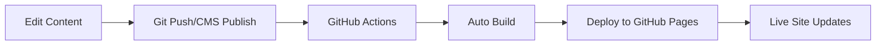

# schmitz.ai

Repo for custom content on schmitz.ai - A responsive, accessible React-based portfolio website showcasing Dan Schmitz's professional experience, skills, and projects.

## 🚀 Quick Start

```bash
# Install dependencies
npm install

# Start development server
npm start

# Build and deploy (automated via GitHub Actions)
git push origin main
```

## 📋 Table of Contents
- [Project Overview](#project-overview)
- [Automated Deployment](#automated-deployment)
- [Content Management System](#content-management-system)
- [Theme Management](#theme-management)
- [Development Workflow](#development-workflow)
- [Directory Structure](#directory-structure)
- [Troubleshooting](#troubleshooting)

## Project Overview

This website demonstrates excellence in interaction design, AI integration, and clean aesthetic. It features:
- **Visual Content Management**: Browser-based CMS for all content editing
- **Shared Theme System**: Single source of truth for styles across site and CMS
- **Automated Deployment**: GitHub Actions handles builds and deploys automatically
- **Flexible Content**: Dynamic content blocks for complete editorial freedom

## 🤖 Automated Deployment

### How It Works
The site now uses **GitHub Actions** for automatic building and deployment. You no longer need to manually run build commands!



### Deployment Methods

#### 1. CMS Changes
1. Edit at `schmitz.ai/admin/`
2. Click "Publish"
3. ✅ Site updates automatically in 2-3 minutes

#### 2. Code Changes
```bash
git add .
git commit -m "Update component"
git push origin main
# ✅ GitHub Actions handles everything else
```

### Monitor Deployments
View build status at: https://github.com/ds1/ds1.github.io/actions

## 📝 Content Management System

### Accessing the CMS
- **Production**: https://schmitz.ai/admin/
- **Local**: http://localhost:3000/admin/
- **Authentication**: GitHub account

### How Content Works
All content is managed through the visual CMS interface. When you publish changes:
1. Content saves to GitHub automatically
2. GitHub Actions triggers
3. Site rebuilds and deploys
4. Changes appear in 2-3 minutes

### Flexible Content Blocks
The CMS now supports dynamic content sections instead of predetermined fields:

#### Available Content Types
- **Headings**: H1, H2, H3
- **Text**: Paragraph, Rich Text (markdown)
- **Media**: Image, Video, GIF
- **Lists**: Dynamic bullet points
- **Special**: Code blocks, Quotes

#### Creating/Editing Case Studies
1. Log into CMS
2. Click "Case Studies" → "New Case Study" (or edit existing)
3. Add metadata (title, description, thumbnail)
4. Build content using "Add Content Section"
5. Choose section type (H2, paragraph, image, etc.)
6. Reorder sections by dragging
7. Publish when ready

### Example Content Structure
```
1. H1: "Project Title"
2. Image: hero-image.jpg
3. H2: "The Challenge"
4. Rich Text: Detailed problem with **bold** and *italic*
5. List: Key objectives
6. H2: "Solution"
7. Image: solution-screenshot.jpg
8. Quote: "Client testimonial"
```

## 🎨 Theme Management

### Shared Theme System
The site uses a unified CSS system that keeps the main site and CMS preview in sync.

#### Theme Architecture
```
public/shared-theme.css     ← Single source of truth
    ├── Used by main site
    └── Used by CMS preview
```

### Changing Theme Colors

#### Method 1: Edit CSS Variables (Simplest)
Edit `public/shared-theme.css`:

```css
:root {
  /* Update colors here - changes apply everywhere */
  --color-primary: #61dafb;      /* Light blue */
  --color-secondary: #8be9fd;    /* Lighter blue */
  --color-background: #282c34;   /* Dark background */
  --color-surface: #3b3e47;      /* Card background */
  --color-text: #ffffff;         /* Main text */
  --color-text-secondary: #b3b3b3; /* Muted text */
}
```

After editing:
```bash
# Copy to production folder
cp public/shared-theme.css docs/

# Deploy
git add .
git commit -m "Update theme colors"
git push origin main
```

#### Method 2: Theme.js Sync (Advanced)
If you prefer to keep `theme.js` as source of truth:

1. Edit `src/styles/theme.js`:
```javascript
rawColors: {
  primary: '#61dafb',  // Change colors here
  secondary: '#8be9fd',
}
```

2. Run sync script:
```bash
npm run sync-theme
```

### Where Theme Changes Apply
✅ Main website  
✅ CMS preview pane  
✅ All React components using CSS variables  
✅ Future components automatically  

## 💻 Development Workflow

### Local Development
```bash
# Start development server
npm start

# The site runs at http://localhost:3000
# The CMS runs at http://localhost:3000/admin
```

### Content Updates

#### All Content via CMS
1. Log into CMS at `/admin`
2. Edit or create content
3. Click "Publish"
4. Changes deploy automatically via GitHub Actions

### Code Updates
```bash
git add .
git commit -m "Update component"
git push origin main
# GitHub Actions handles the build and deploy
```

### Manual Build (If needed)
```bash
# Only if GitHub Actions is down
npm run convert-content  # Convert CSV/CMS to JSON
npm run build           # Build React app
npm run deploy          # Deploy to GitHub Pages
```

## 📁 Directory Structure

```
project-root/
├── .github/
│   └── workflows/
│       └── build-and-deploy.yml    # GitHub Actions automation
├── content/                        
│   ├── *.csv                       # Legacy CSV files (not actively used)
│   └── cms/                        # CMS-generated content
│       └── case-studies/           # Individual JSON files from CMS
├── public/
│   ├── shared-theme.css            # Unified theme styles
│   └── admin/
│       ├── index.html              # CMS interface
│       └── config.yml              # CMS configuration
├── scripts/
│   ├── convertContent.js           # Legacy CSV converter
│   ├── convertCMSContent.js        # CMS → JSON converter
│   └── syncTheme.js               # Theme sync (optional)
├── src/
│   ├── components/                 # React components
│   ├── data/                       # Generated JSON (don't edit)
│   ├── images/                     # Image assets
│   ├── pages/                      # Page components
│   └── styles/
│       └── theme.js                # Theme configuration
└── docs/                           # GitHub Pages deployment
```

## 🔧 Configuration Files

### CMS Configuration (`public/admin/config.yml`)
- Defines content structure
- Sets up flexible content blocks
- Configures media handling

### GitHub Actions (`.github/workflows/build-and-deploy.yml`)
- Triggers on push to main
- Runs content conversion
- Builds React app
- Deploys to GitHub Pages

## 📚 Content Guidelines

### Rich Text Formatting
In CSV files and CMS rich text fields:
- **Bold**: `**text**`
- **Italic**: `*text*`
- **Bold+Italic**: `***text***`
- **Line Break**: `\n`
- **Paragraph Break**: `\n\n`
- **Color Spans**: `<span class="text-primary">text</span>`

### Available Color Classes
- `text-primary` - Theme primary color
- `text-secondary` - Theme secondary color
- `text-success` - Green
- `text-warning` - Yellow
- `text-error` - Red

### Image Management
- Store images in `src/images/`
- Reference in content as `/images/filename.jpg`
- Supports: JPG, PNG, GIF, WebP
- Videos: MP4, WebM

## 🐛 Troubleshooting

### Content Not Updating
1. Check GitHub Actions: https://github.com/ds1/ds1.github.io/actions
2. Clear browser cache (Ctrl+Shift+R)
3. Wait 2-3 minutes for deployment

### CMS Login Issues
1. Clear cookies for schmitz.ai
2. Re-authenticate with GitHub
3. Check GitHub permissions

### Theme Changes Not Showing
1. Ensure you copied `shared-theme.css` to `docs/`
2. Clear browser cache
3. Check CSS syntax for errors

### Build Failures
1. Check GitHub Actions logs
2. Run locally to debug:
```bash
npm run convert-content
npm run build
```

## 🚀 Advanced Features

### Custom Preview Styles
The CMS preview pane uses the same styles as the live site through `shared-theme.css`. Changes to theme colors immediately reflect in both places.

### Content Merge Strategy
- CSV content is converted first
- CMS content is merged, taking precedence for matching IDs
- Both sources combine in the final JSON

### Monitoring
- **GitHub Actions**: https://github.com/ds1/ds1.github.io/actions
- **Live Site**: https://schmitz.ai
- **CMS**: https://schmitz.ai/admin/

## 📮 Support

For issues or questions:
- Create an issue in this repository
- Contact: dan@schmitz.ai

## 🎯 Key Commands Reference

```bash
# Development
npm start                    # Start local server
npm run convert-content      # Manual content conversion

# Theme Management
npm run sync-theme          # Sync theme.js to CSS (optional)

# Deployment (automatic via GitHub Actions)
git push origin main        # Triggers auto-deploy

# Manual Deployment (rarely needed)
npm run build              # Build for production
npm run deploy             # Deploy to GitHub Pages
```

---

Built with React, Decap CMS, and GitHub Pages. Automated with GitHub Actions.